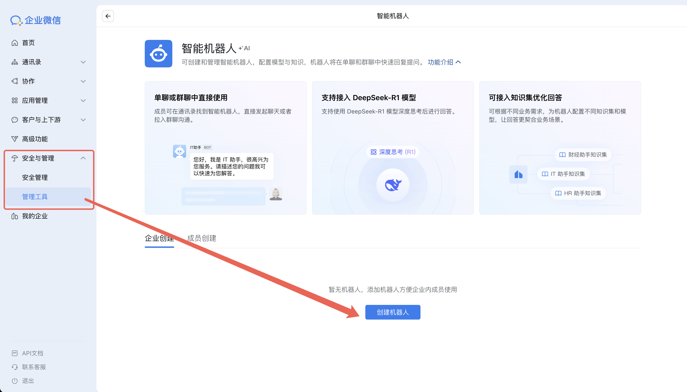
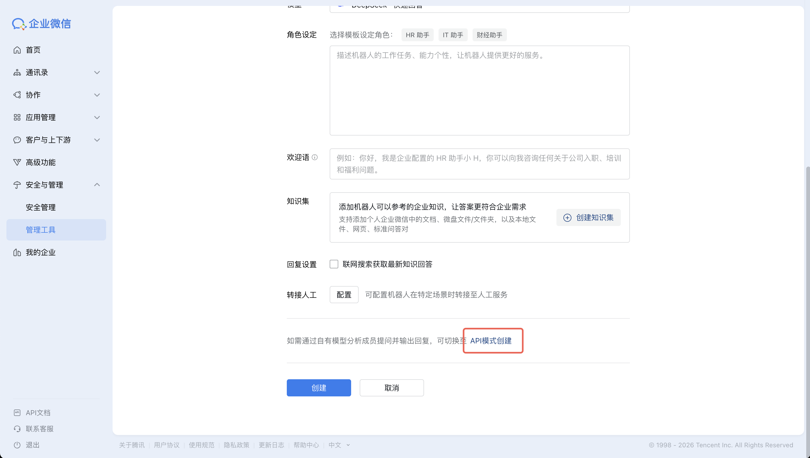
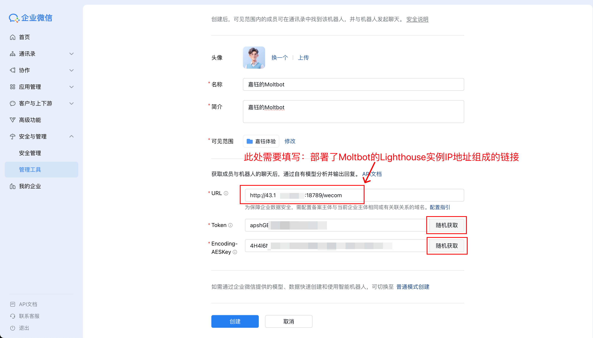

# OpenClaw WeCom (WeChat Work) Channel Plugin

Maintainer: Jams

Status: WeCom intelligent bot (API mode) via encrypted webhooks + passive replies (stream).

## Install

### Local development (link)
```bash
openclaw plugins install --link wecom
openclaw plugins enable wecom
openclaw gateway restart
```
> Note: You can also use `moltbot` or `clawdbot` instead of `openclaw`.

## Configure

1) Create a WeCom "intelligent bot (API mode)" in the WeCom console and collect the required parameters:
   - `Token`
   - `EncodingAESKey`
   - `ReceiveId` (often empty for intelligent bots)

   Configuration examples in WeCom console:

   
   
   

2) Configure OpenClaw:

```json5
{
  "channels": {
    "wecom": {
      "enabled": true,
      "webhookPath": "/wecom",
      "token": "YOUR_TOKEN",
      "encodingAESKey": "YOUR_ENCODING_AES_KEY",
      "receiveId": "",
      "dm": { "policy": "pairing" }
    }
  }
}
```

## Notes

- Webhooks require public HTTPS. For security, only expose the `/wecom` path to the internet.
- Stream behavior: the first reply may be a minimal placeholder; WeCom will call back with `msgtype=stream` to refresh and fetch the full content.
- Limitations: passive replies only; standalone send is not supported.

---

# OpenClaw 企业微信（WeCom）Channel 插件

维护者：Jams

状态：支持企业微信智能机器人（API 模式）加密回调 + 被动回复（stream）。

## 安装

### 本地开发（link）
```bash
openclaw plugins install --link wecom
openclaw plugins enable wecom
openclaw gateway restart
```
> 注意：你也可以使用 `moltbot` 或 `clawdbot` 代替 `openclaw`。

## 配置

1) 在企业微信后台创建"智能机器人（API 模式）"，获取以下参数：
   - `Token`
   - `EncodingAESKey`
   - `ReceiveId`（部分场景需要；智能机器人常见为空字符串）

   企业微信后台配置示例：

   
   
   

2) 配置 OpenClaw：

```json5
{
  "channels": {
    "wecom": {
      "enabled": true,
      "webhookPath": "/wecom",
      "token": "YOUR_TOKEN",
      "encodingAESKey": "YOUR_ENCODING_AES_KEY",
      "receiveId": "",
      "dm": { "policy": "pairing" }
    }
  }
}
```

## 说明

- webhook 必须是公网 HTTPS。出于安全考虑，建议只对外暴露 `/wecom` 路径。
- stream 模式：第一次回包可能是占位符；随后 WeCom 会以 `msgtype=stream` 回调刷新拉取完整内容。
- 限制：仅支持被动回复，不支持脱离回调的主动发送。
